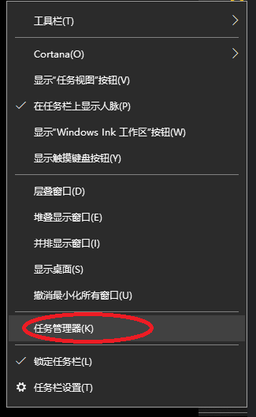
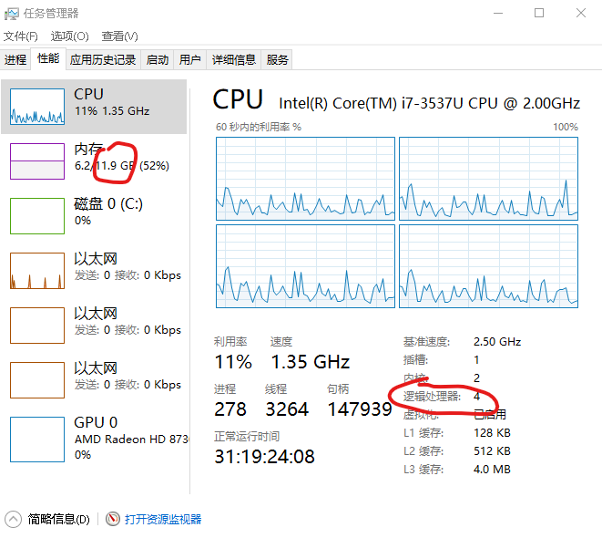
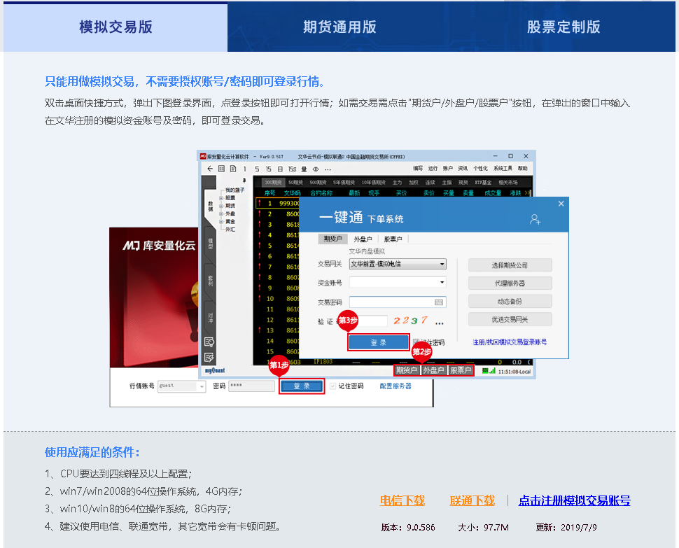
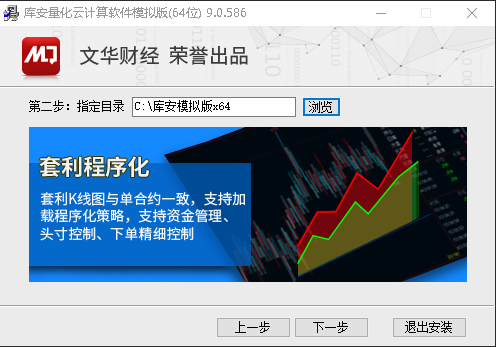
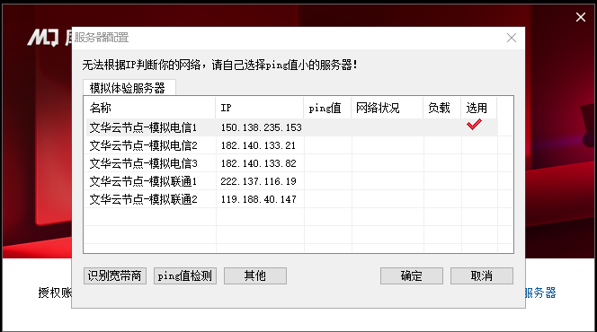
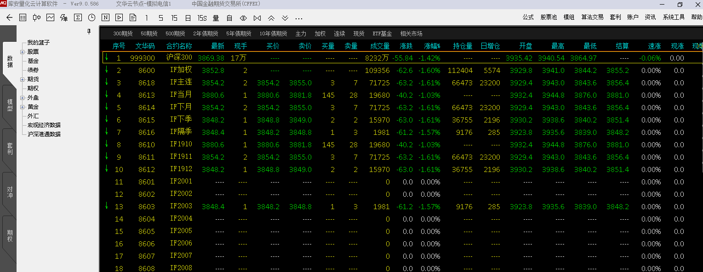

# 期权学习与交流

## 准备环境
### 0. 电脑最低配置必须满足下列条件，否则软件启动会报错退出
#### a. 内存不小于8GB
#### b. CPU不少于4核
    
#### 查看方法:
#### c. 在windows任务栏上单击右键，选择任务管理器

#### d. 在“性能”界面上，CPU的逻辑处理器数量不能小于4，物理内存不能小于8GB

### 1. 访问http://mq.wenhua.com.cn
### 2. 如图下载模拟交易版
### 
### 3. 注册模拟账号（不想用文华交易无需注册）
### 4. 软件安装（一路单击下一步，最后点完成）

### 5. 启动（第一次启动需要选择“配置服务器”，根据自己的宽带随便选电信、联通即可）

### 6. 点登录，进入主界面

