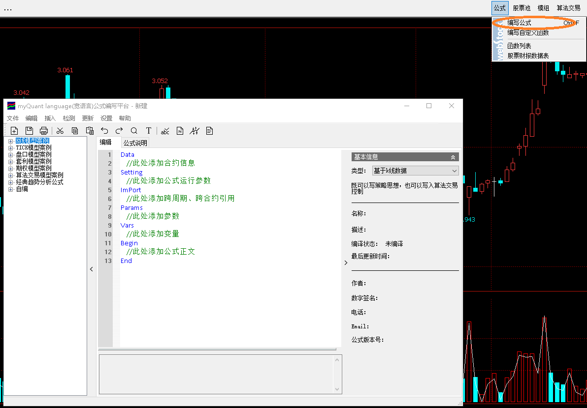
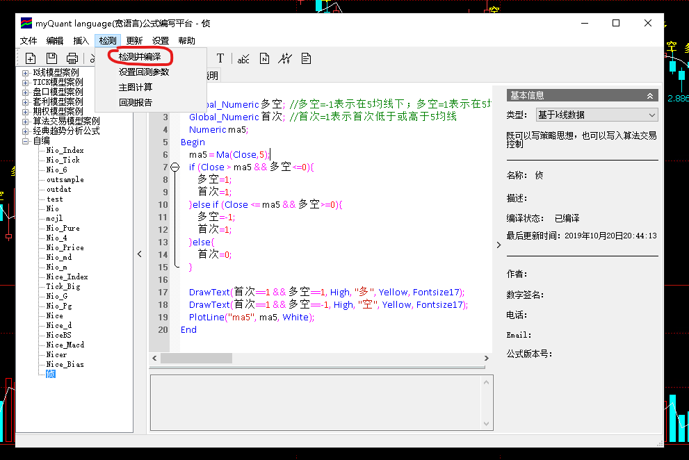
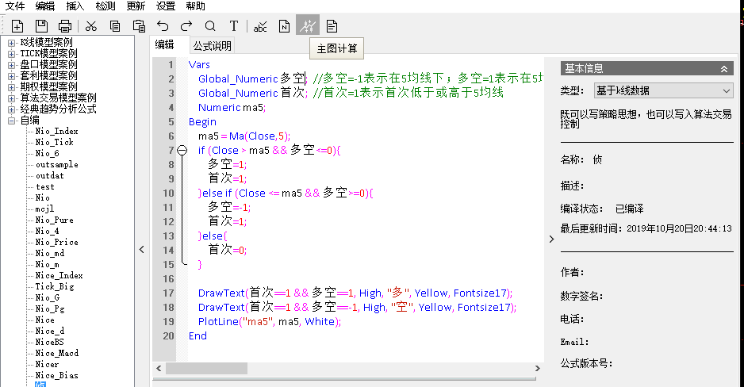
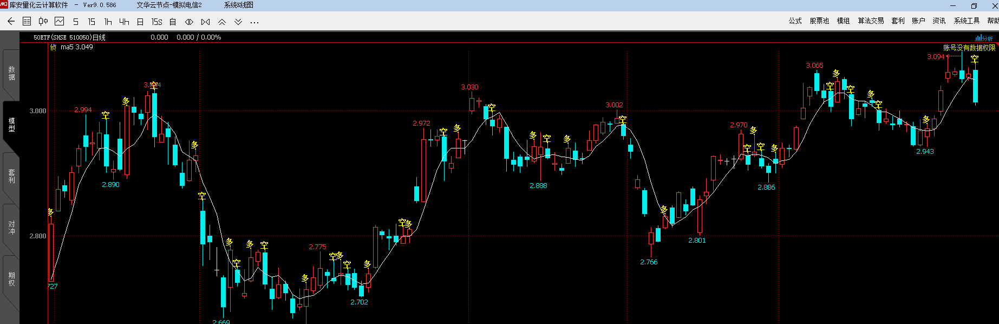
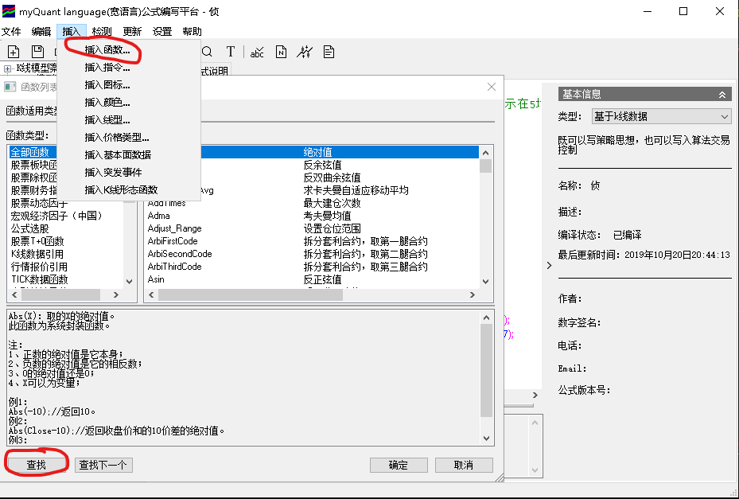

# 公式编写

## 自定义公式简介

乍看上去比较复杂，但是通常只会写成下面这样
```
Vars
    //此处添加变量
Begin
    //此处添加公式正文
End
```
公式运行的时候每根k线都会计算一遍公式正文。

## 激动人心的第一个公式
描述：当k线收盘价首次低于5均线时，显示“空”；当k线收盘价首次高于5均线时，显示“多”。

1. 定义变量
“多空”：表示收盘价是否在5均线上方
“首次”：表示收盘价是否首次突破、跌穿5均线
“ma5”：存放当前K线对应的5均线的值
***注意：Numeric表示存放的内容是数字，并且每根k线计算前内容都会自动清零***
***Global_Numeric表示存放的内容是数字，且不会自动清零***

```
Vars

Global_Numeric 多空;  //多空=-1表示在5均线下；多空=1表示在5均线上；多空=0表示初始状态
Global_Numeric 首次;  //首次=1表示首次低于或高于5均线
Numeric ma5;

Begin

End
```

2. 计算5均线的值

```
Vars

Global_Numeric 多空;
Global_Numeric 首次;
Numeric ma5;

Begin

	ma5 = Ma(Close,5); // Ma为系统内置函数，意思是最近5根k线的收盘价相加除以5

End
```

3. 判断收盘价与5均线之间关系

```
Vars
    Global_Numeric 多空;
    Global_Numeric 首次;
    Numeric ma5;
Begin
    ma5 = Ma(Close,5);
    if (Close > ma5 && 多空<=0){ // 如果收盘价高于5均线，并且之前的k线在5均线以下
        多空=1;
        首次=1;
    }else if (Close <= ma5 && 多空>=0){ // 如果收盘价高于5均线，并且之前的k线在5均线以上
        多空=-1;
        首次=1;
    }else{  // 收盘与之前的k线都在5均线一侧
        首次=0;
    }
End
```

4. 绘制多空信号与5均线
```
Vars
	Global_Numeric 多空;  
	Global_Numeric 首次;  
	Numeric ma5;
Begin
	ma5 = Ma(Close,5);
	if (Close > ma5 && 多空<=0){
		多空=1;
		首次=1;
	}else if (Close <= ma5 && 多空>=0){
		多空=-1;
		首次=1;
	}else{
		首次=0;
	}
	
    // 如果首次位于5均线上方条件成立，在k线最高价上方用黄色绘制“多”信号，文字大小17
	DrawText(首次==1 && 多空==1, High, "多", Yellow, Fontsize17);
    
    // 如果首次位于5均线下方条件成立，在k线最高价上方用绿色绘制“空”信号，文字大小17
	DrawText(首次==1 && 多空==-1, High, "空", Green, Fontsize17);
    
    // 用白色绘制5均线
	PlotLine("ma5", ma5, White);
End
```

5. 保存并编译（每次修改代码，必须再次“检测并编译”）


6. 运行 （单击“主图计算”）
***注：该公式需要在k线上方绘制多空信号，因此运行之前需要先点击选中k线区域（右上角出现红色三角形）***


1. 效果图


8. 系统内置函数查询（在公式编辑界面单击“插入” => “插入函数”；弹出的对话框内列出了所有系统函数且配有详细的用法
