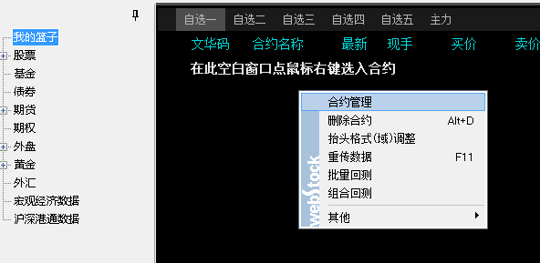
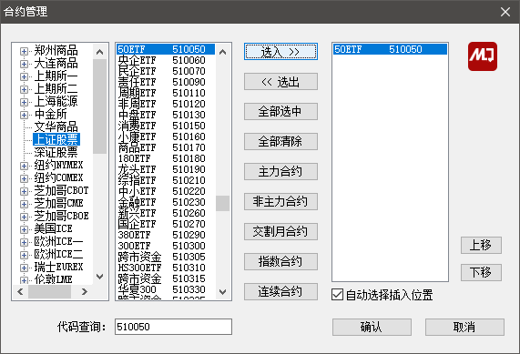
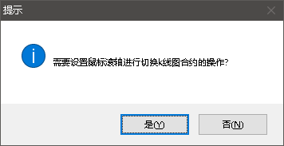
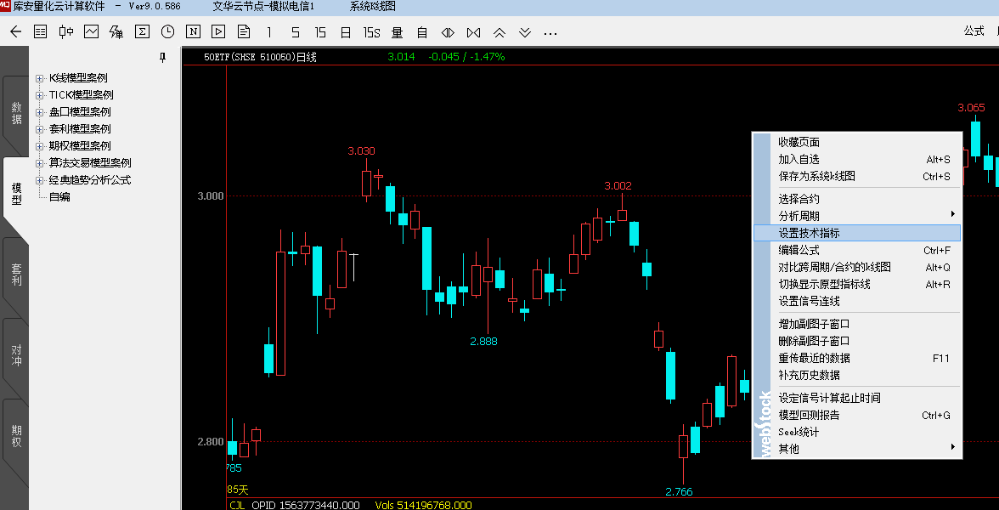
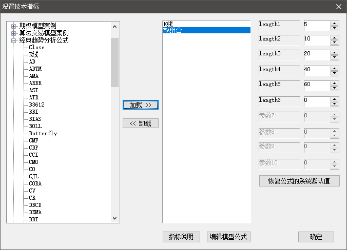
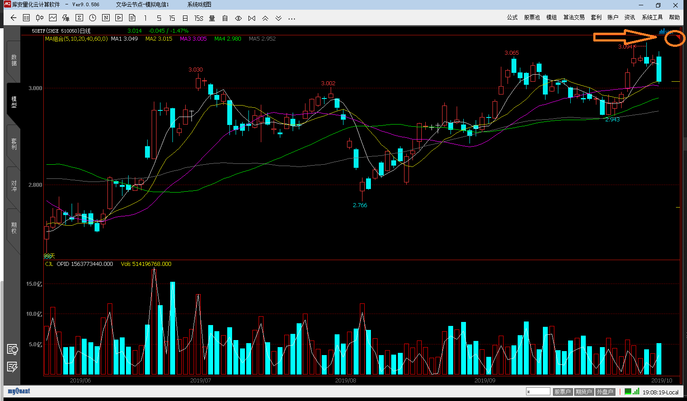

# 常用操作

## 添加自选股
### a. 选中“我的篮子” => 右键 => 合约管理

### b. 输入代码 => 选入 => 确认

## K线缩放
### a. 双击添加的合约品种进入k线界面
### b. 滚动鼠标滚轮 => 对话框选“否” （选是的话鼠标滚轮就变成切换合约了，个人不太习惯）

## 添加均线
### a. k线区域右键 => 设置技术指标

### b. 展开“经典趋势分析公式” => 选择“MA组合”

## 添加 MACD 副图指标
