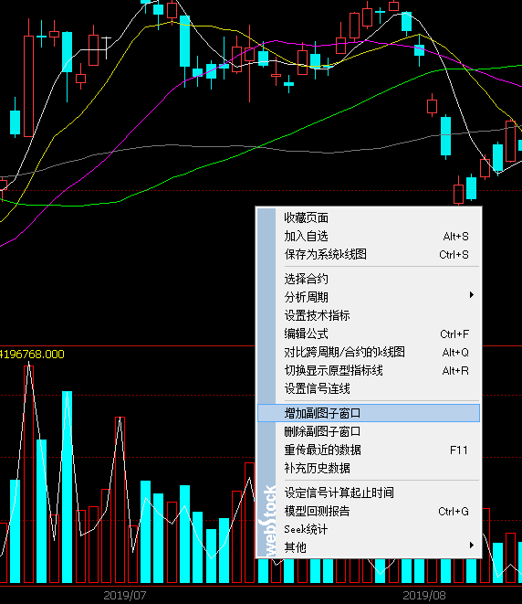
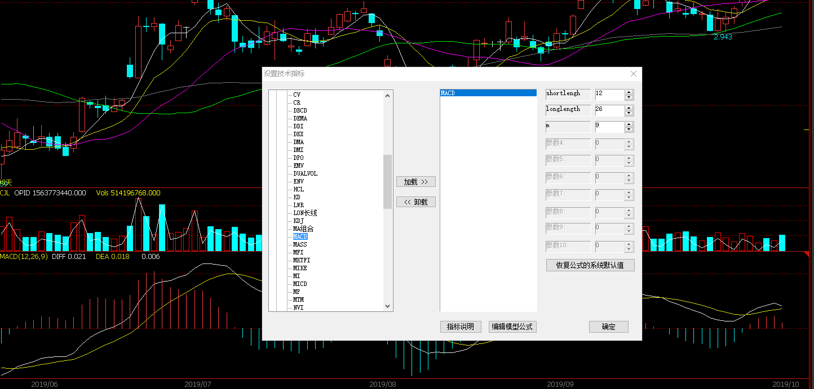
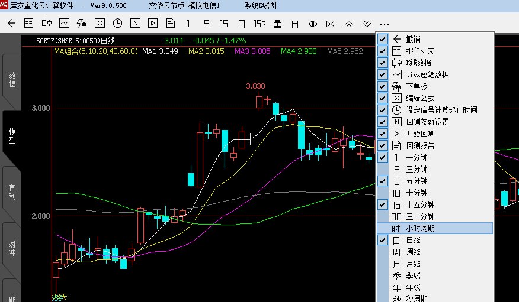
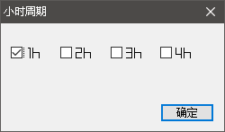
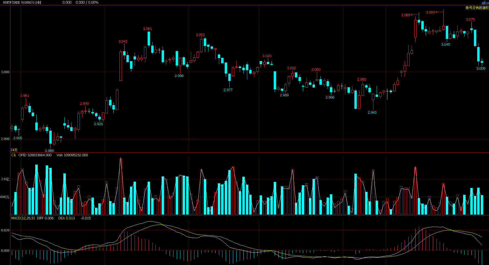

# 常用操作

## 添加自选股
### 1. 选中“我的篮子” => 右键 => 合约管理

### 2. 输入代码 => 选入 => 确认

## K线缩放
### 1. 双击添加的合约品种进入k线界面
### 2. 滚动鼠标滚轮 => 对话框选“否” （选是的话鼠标滚轮就变成切换合约了，个人不太习惯）

## 添加均线
### 1. k线区域右键 => 设置技术指标

### 2. 展开“经典趋势分析公式” => 选择“MA组合”

注意下图右上角红色三角，表明当前选中的是k线区域

## 添加 MACD 副图指标
### 1. 右键单击k线区域 => 选“增加附图子窗口”

### 2. 右键单击新添加的副图子窗口区域 => 选"设置技术指标" => 展开经典趋势分析公式 => 选择"macd" => 单击“加载”，“确定”

## 切换到一小时级别k线
### 1. 单击工具栏按钮“...” => 选“小时周期”

### 2. 勾选“1h" => 确定

### 3. 单击工具栏上新出现的“1h”按钮
